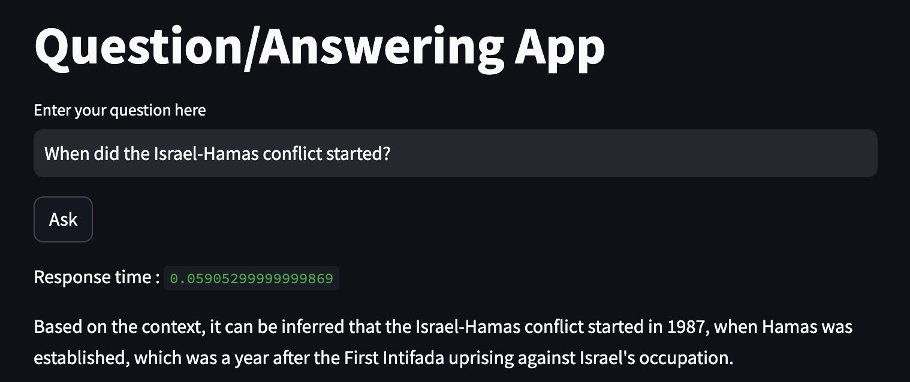
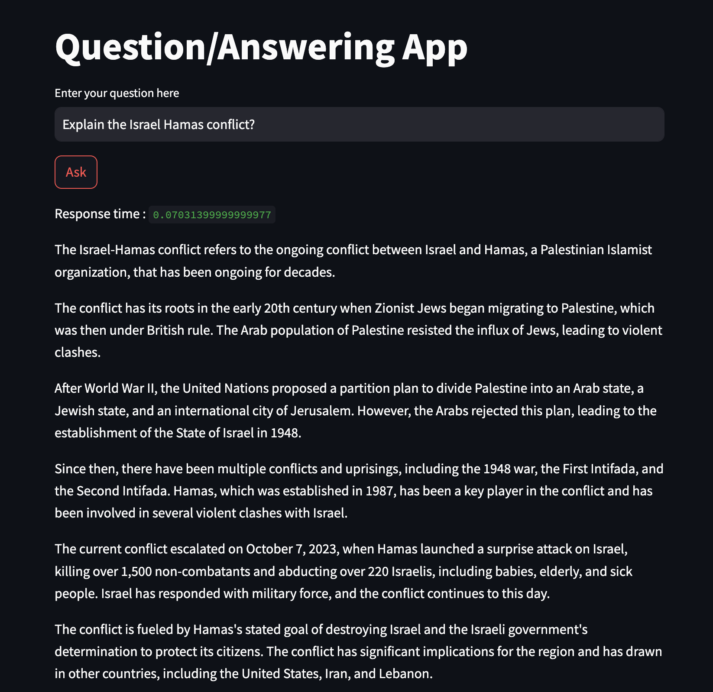

## Solution
Task: Create a rudimentary Question Answering system that can answer questions related to the Israel Hamas war.

- I used **mixtral-8x7b-32768** due to it's bigger context size using Groq inference for faster responses(free for all).
- I used **OpenAI embeddings**.
- Utilized **Streamlit** for the user interface (UI).
- Employed **LangChain** to interact with the LLM.
- Used **regex** for performing basic data cleaning.
- I used **ObjectBox DB** to store my vectors.
 
 ## Project Structure

- `app.py`: A Python file containing the implementation of the QnA System
- `clean_data.ipynb`: A Jupyter Notebook for cleaning the JSON file.
- `requirements.txt`: A file listing all the Python packages required to run the code.
- `solution.md`: This file, explaining the project and the code.
- `contact_me.txt`: A file containing my contact information.

## Sample Outputs
1.  Question: When did the Israel-Hamas conflict started?

<br><br><br>
2.  Explain the Israel Hamas conflit?


## How to run the app
1. Firstly, clone the repository
2. Create a virutal environment
3. Install the dependencies by running the following command
```
pip install -r requirements.txt
```
4. Run the app
```
streamlit run app.py
```